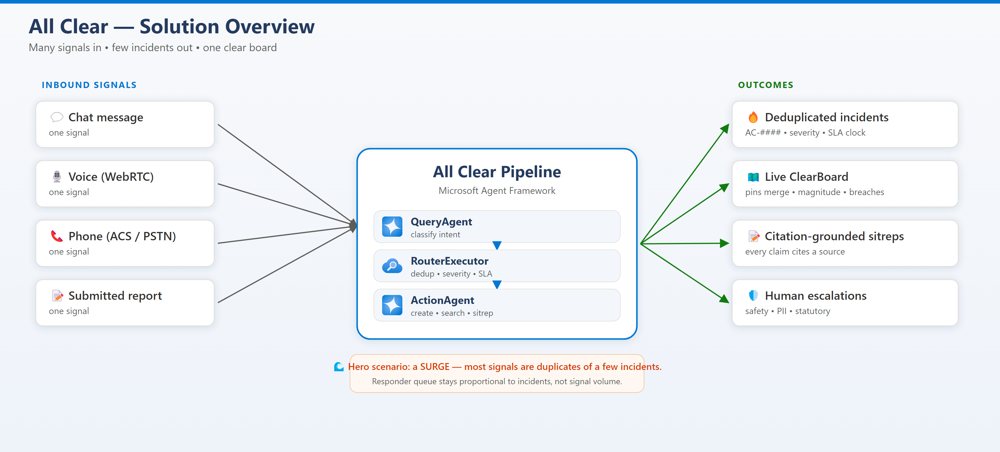
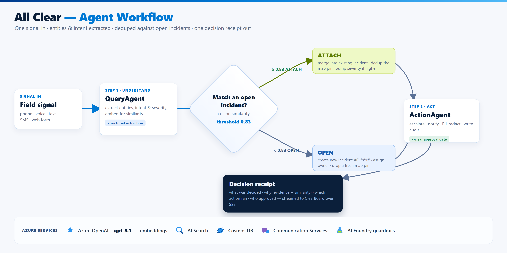
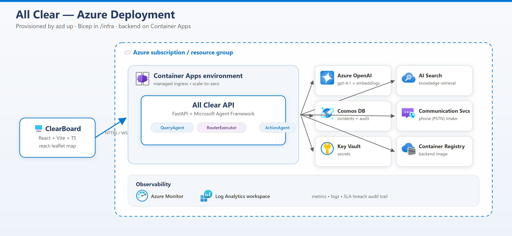

<div align="center">


# 🚨 All Clear: Surge-Grade Incident Triage

**Many signals. Few incidents. One clear board.**

</div>

[](https://python.org)
[](https://fastapi.tiangolo.com)
[](https://github.com/microsoft/agent-framework)
[](https://react.dev)
[](https://typescriptlang.org)
[](https://azure.microsoft.com)
[](LICENSE)

> **Collapse the surge.** When a storm, outage, or recall makes 40 people report the same thing, All Clear deduplicates those **signals** into a handful of real **incidents**, routes each by severity and SLA, and drives a live map that flips green when everything is resolved.

> 🧬 **Heritage.** All Clear is the production pivot of [**47 Doors**](https://github.com/EstablishedCorp/47doors). The same three-agent shape — classify → route → act — is rebuilt on the **Microsoft Agent Framework (MAF)** for incident triage in public safety, customer comms, and regulated industries.

---

## 📖 Overview

All Clear is a MAF-based triage pipeline that turns a flood of inbound **signals** into a small, accurate set of **incidents** so responders work the *event*, not the noise. Each signal flows through one coordinated pipeline that:

- 🎯 **Classifies intent** from a single inbound signal (chat, voice, phone, or report)
- 🧲 **Deduplicates** by embedding similarity — duplicate signals **attach** to an open incident instead of spawning new ones
- 📊 **Tracks magnitude** — every attached report increments the incident's public-impact counter
- 🔀 **Routes by queue** (field-operations, customer-comms, compliance-desk, engineering, escalations)
- 🚦 **Maps severity & SLA** deterministically (SEV1–SEV4) — rules, never model vibes
- 🎫 **Opens incidents** and **searches knowledge** only on the non-duplicate path (keeps surge latency flat)
- 📝 **Generates sitreps** — citation-grounded situation reports where every claim cites a source
- 🛡️ **Escalates to humans** on safety/PII/sentiment rules — a security control, not a refactor
- 🗺️ **Drives the ClearBoard** — a live map where incident pins visibly merge as reports attach, SLA breaches highlight, and the board flips to its green **all-clear** state

**🎯 The hero scenario:** a **surge** where most signals are duplicates of a few incidents. All Clear keeps the responder's queue proportional to *incidents*, not *signal volume*.

### 🗺️ Solution Architecture



---

## 🧱 Domain Language

One canonical term per concept (see [`CONTEXT.md`](./CONTEXT.md) — if code and that doc disagree, the doc wins).

| 🧩 Term | 📝 Meaning |
| ------- | ---------- |
| 📡 **Signal** | One inbound communication on any channel. Never deduplicated away; always attributable. |
| 🔥 **Incident** | The real-world event signals describe (`AC-####`). Has severity, queue, SLA clock, magnitude, status. |
| 🔗 **Report** | The association of a signal to an incident; attaching one increments magnitude. |
| 📊 **Magnitude** | Count of reports on an incident — a proxy for scale; drives ClearBoard weight. |
| 🚪 **Queue** | Destination work stream (replaces 47 Doors' "department"). |
| 📝 **Sitrep** | Citation-grounded situation report from `generate_sitrep`. |
| ✅ **All clear** | Terminal state — every incident resolved, every SLA satisfied. Also the product name. |
| 🌊 **Surge** | Inbound volume spike where most signals are duplicates. The hero scenario. |
| 🗺️ **ClearBoard** | Live map view: pins merge on dedup, magnitude counters, SLA breach highlighting. |

---

## 🏗️ Architecture

### 🔄 Three-Stage Pipeline

Three input modalities — text chat, browser voice (WebRTC), and phone (ACS/PSTN) — all route through the **same** pipeline. Each agent has **bounded authority**: it can do only what its role and tools permit.



1. 🎯 **QueryAgent** *(MAF agent, `app/agents/query_agent.py`)* — classifies one signal into intent, entities, severity indicators, and PII flags. Authority: **classify only**.
2. 🔀 **RouterExecutor** *(deterministic MAF workflow, `app/agents/router_agent.py`)* — **zero LLM calls by design and by test.** Runs dedup → severity/SLA mapping → escalation rules → a `RoutingDecision`.
3. ⚡ **ActionAgent** *(MAF agent, `app/agents/action_agent.py`)* — exactly three tools: `create_incident`, `search_knowledge`, `generate_sitrep`. Authority: only what its tools permit.

> 🧲 **Dedup keeps surges flat.** At or above `DEDUP_THRESHOLD` (default **0.83** cosine) a signal **attaches** to an open incident (`ATTACH_TO_INCIDENT`) — magnitude increments, the reporter gets a short ack, and **no knowledge search runs**. Below it, a new incident opens (`OPEN_INCIDENT`) and the full ActionAgent path executes.

### 🚦 Severity & SLA

Severity is mapped from classification indicators by RouterExecutor rules — never by the model. Thresholds live in [`config.py`](./backend/app/core/config.py), never in code.

| 🔺 Severity | 📋 Meaning | ⏱️ Response SLA |
| :---------: | ---------- | :-------------: |
| 🔴 **SEV1** | Life safety, total outage, statutory clock running — immediate escalation | **15 min** |
| 🟠 **SEV2** | Major impairment, public-facing, spreading | **1 hr** |
| 🟡 **SEV3** | Contained, single-party impact | **4 hrs** |
| 🟢 **SEV4** | Informational, routine request | **Next business day** |

> ⚖️ A **statutory clock** (breach-notification / recall windows) forces SEV1 regardless of other indicators. Breached SLA clocks highlight on the ClearBoard and are written to the audit log.

### ☁️ Azure Infrastructure



| 🔧 Service | 📝 Purpose |
| ---------- | ---------- |
| 🛡️ API Management | **AI gateway** in front of the API/model — rate limits · token budgets · JWT validation · usage metrics *(Day-1 production posture; not provisioned by `azd up`)* |
| 🤖 Azure OpenAI | Signal classification + sitrep generation (`gpt-5.1`) |
| 🧠 Azure OpenAI Embeddings | `text-embedding-3-small` (1536-dim) for dedup similarity |
| 🔍 Azure AI Search | Knowledge base retrieval (`text-embedding-3-small` index) |
| 📦 Container Apps | Backend API hosting (managed ingress · scale-to-zero) |
| 💾 Cosmos DB | Incident / audit persistence |
| 📞 Communication Services | Phone (PSTN) intake + call automation |
| 🔐 Key Vault | Secrets management |
| 📚 Container Registry | Backend container image |
| 🧪 Azure AI Foundry | Red team · AI-quality evals · content-filter guardrails *(East US 2)* |
| 📊 Azure Monitor + Log Analytics | Observability / telemetry |

---

## 🚀 Quickstart

### 🟡 Mock mode (offline, zero Azure credentials) — start here

The **entire** pipeline runs offline against mock twins of every Azure service. Every live service has a mock twin and they stay in lockstep.

```bash
cd backend
python -m venv .venv
.venv\Scripts\activate          # Windows  (use: source .venv/bin/activate on macOS/Linux)
pip install -r requirements.txt

# Run the full pipeline offline — deterministic, no Azure needed
$env:ENVIRONMENT="test"; $env:MOCK_MODE="true"
uvicorn app.main:app --reload --port 8000
```

```bash
# Frontend (new terminal)
cd frontend
npm install
npm run dev
```

> 🧪 Mock mode is enabled by `MOCK_MODE=true` / `USE_MOCK_MODE=true`. `Settings.use_mock_services` is also true in the `test` environment.

### 🔵 Deploy to Azure with `azd`

```bash
azd auth login
azd up
```

`azd up` provisions the Bicep stack in [`infra/`](./infra/) and deploys the backend to Container Apps. The `postdeploy` hook prints the backend URL and its `/api/health` endpoint.

---

## 📡 API Reference

| 🔧 Method | 🔗 Endpoint | 📝 Description |
| --------- | ----------- | -------------- |
| `POST` | `/api/signals` | 📡 Submit an inbound signal to the pipeline |
| `POST` | `/api/chat` | 💬 Submit a signal (chat alias of `/api/signals`) |
| `GET` | `/api/knowledge/search` | 📚 Search the knowledge base |
| `GET` | `/api/health` | 💚 Service health |
| `POST` | `/api/realtime/session` | 🎤 Create an ephemeral realtime (voice) session |
| `WS` | `/api/realtime/ws` | 🎤 Realtime tool relay |
| `GET` | `/api/realtime/health` | 🎤 Realtime availability |
| `POST` | `/api/phone/incoming` | 📞 ACS incoming-call webhook |
| `POST` | `/api/phone/callbacks` | 📞 ACS call callbacks |
| `GET` | `/api/phone/health` | 📞 Phone service health |
| `GET` | `/api/phone/transcripts/stream` | 📺 SSE transcript stream for the ClearBoard |
| `WS` | `/ws/acs-media` | 🔊 ACS media relay |

---

## 🧪 Testing

### 📊 Current Test Status

| Suite | Tests | Status |
| ----- | ----: | ------ |
| Backend (pytest, mock mode) | 274/274 | ✅ Passing |
| Backend CI (clean venv) | `allclear-backend-ci.yml` | ✅ |
| Smoke (agents · evals · models · spec) | `smoke-test.yml` | ✅ |
| Frontend (vitest) | — | ✅ |

> Backend tests run with `ENVIRONMENT=test` and `MOCK_MODE=true` — no Azure credentials required.

### 🔧 Backend

```bash
cd backend
python -m pytest tests/ -v --tb=short
```

### 🎨 Frontend

```bash
cd frontend
npm test          # vitest unit tests
npm run test:e2e  # Playwright E2E
```

---

## 📁 Project Structure

```
all-clear/
├── 🔧 backend/              # FastAPI + Microsoft Agent Framework
│   └── app/
│       ├── 🤖 agents/       # QueryAgent · RouterExecutor · ActionAgent · pipeline
│       ├── 📡 api/          # signals, knowledge, realtime, phone, transcripts
│       ├── ☁️ services/     # Azure twins (LLM, search, phone) + mock twins
│       └── ⚙️ core/         # config (SLA, dedup threshold), dependencies
├── 🎨 frontend/             # React + Vite + TypeScript ClearBoard
├── ☁️ infra/                # Azure Bicep templates
├── 📋 specs/                # MAF rehost + production-deployment specs
├── 📚 docs/                 # Architecture + product docs
├── 🛠️ scripts/             # quickstart / smoke / validation
├── 📄 CONTEXT.md            # Ubiquitous domain language (source of truth)
├── 🐳 docker-compose.yml
└── 📄 azure.yaml            # azd deployment manifest
```

> 🧹 Some directories (`coach-guide/`, `coach-site/`, `hackathon-site/`, `workshop-site/`, `labs/`, `allclear-dropin/`) are 47 Doors bootcamp leftovers retained during the rehost.

---

## 🛡️ Security Posture

All Clear adopts a **CJIS mindset** everywhere — even where it doesn't legally apply: least privilege, full audit, no PII echo. **Escalation logic is a safety control**: code that weakens it is a security blocker, not a refactor. Each agent operates under **bounded authority** enforced by code structure (tools, interfaces), not prompt hope.

---

## 🤝 Contributing

1. 🍴 Fork the repository
2. 🌿 Create a feature branch (`git checkout -b feature/amazing-feature`)
3. ✅ Run `python -m pytest` in `backend/` (mock mode) before committing
4. 💾 Commit your changes
5. 🔀 Open a Pull Request

### 👥 Contributors

- **Sean Gayle** ([@msftsean](https://github.com/msftsean)) — Operational dashboards, foundry integration, evals harness, guardrails infrastructure

---

## 📄 License

This project is licensed under the MIT License — see the [LICENSE](LICENSE) file for details.
